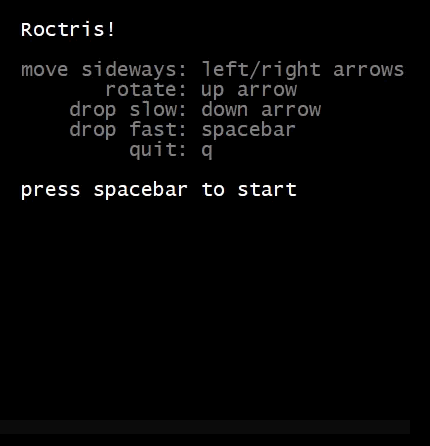

# Roctris
Roctris is a minimal clone of a popular video game, created to learn the Roc programming language.

It has only been compiled and tested with WSL2 running `Ubuntu 20.04.3 LTS`

## Installation 

1. Download [Roc](https://github.com/rtfeldman/roc/) and download [Roctris](https://github.com/cjcone/roctris/) next to Roc.
2. Follow Roc's instructions for setting up the nix shell.
3. navigate to the Roc folder, run `nix-shell`
4. run `cargo run ../roctris/Roctris.roc`

## Playing

- Spacebar to start the game from the intro screen
- Left/Right arrow keys to move
- Up arrow key to rotate
- Down array key to move down one space
- Spacebar to drop to the bottom
- Q or ctrl+c to quit
